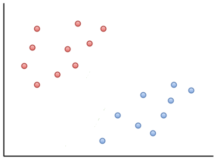
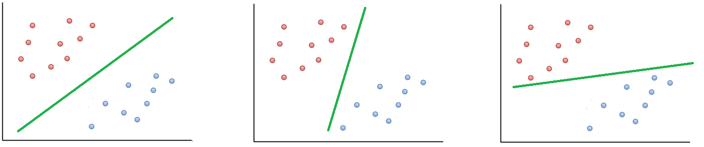
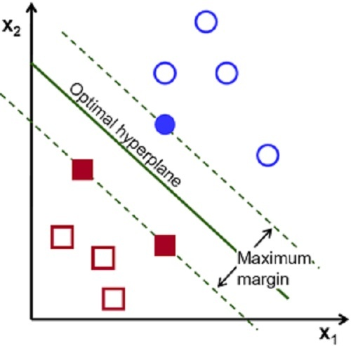
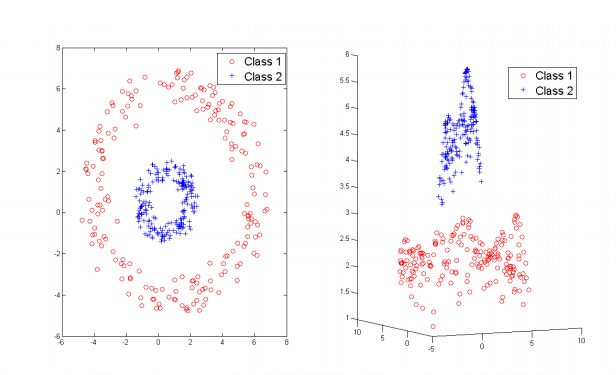

<style>
body {text-align: justify} </style>

```{r setup, include=FALSE}
knitr::opts_chunk$set(echo = TRUE, fig.align='center')
library(knitr)
library(rgl)
knit_hooks$set(webgl = hook_webgl)
```

Les Support Vector Machine (SVM) - Machine à Vecteurs de Support en français - constituent un algorithme d’apprentissage automatique utilisé pour les problèmes de classification. 

## Principe
Imaginons que l’on se place dans un plan à 2 catégories: les points rouges et les points bleus, chacuns dans un côté différent du plan. Supposons qu'un nouveau point entre dans le plan. La question se pose alors de savoir de quel côté du plan le placer. Pour cela, il faut connaître la frontière de séparation (appelée hyperplan séparateur) et déterminer de quel côté de cette dernière placer le point et donc à quelle catégorie il appartient. C'est l'objet du SVM.

<center>{width=6.5cm}</center>

Comme dit précédement, le SVM est un algorithme d'apprentissage automatique. C'est-à-dire qu'au départ, il ne sait pas comment classer les données. C'est en "apprenant" sur les données dites d'apprentissage qu'il sera ensuite capable de classer correctement les dernières entrées.  
Problème: il existe une multitude d'hyperplans séparateurs possibles.
{width=30cm}
Comment donc sélectionner le meilleur d'entre eux ? Il s'agit en fait de celui qui se place le plus loin possible des points bleus mais aussi des points rouges : c’est la critère de la marge optimale. La marge correspond au double de la distance du point le plus proche de l’hyperplan. Les observations placées sur la marge sont appelés vecteurs de support, d'où le nom de Machine à Vecteurs de Support.

<center>{width=8cm}</center>

## Formalisation
Dans un problème à deux dimensions l'hyperplan est une droite. Mais la classification peut aussi se faire pour un problème à 3 dimensions ou plus.

```{r, webgl=TRUE, echo=FALSE}
library("e1071")
library("rgl")
train <- iris
train$y <-ifelse(train[,5]=="setosa", 1, -1)
sv <- svm(y~Petal.Length+Petal.Width+Sepal.Length, data=train, kernel="linear", scale=FALSE, type="C-classification")
W <- rowSums(sapply(1:length(sv$coefs), function(i) sv$coefs[i]*sv$SV[i,]))
plot3d(train$Petal.Length, train$Petal.Width, train$Sepal.Length, ylab="", xlab="", zlab="", col= ifelse(train$y==-1,"red","blue"), size = 2, type='s', alpha = .6, sub="Un exemple dans un espace a 3 dimensions")
rgl.planes(a = W[1], b=W[2], c=W[3], d=-sv$rho, color="green", alpha=.4)
```


Dans tous les cas, l'hyperplan séparateur est défini par l'équation suivante :
$$h(x)=w_1x_1+w_2x_2+\ldots+w_nx_n+b =0 $$
$$g(x)=sgn(h(x))=\begin{cases} ~  1 & \mbox{si h(x) > 0 }\\ ~ -1 & \mbox{si h(x) < 0 } \end{cases}$$
$g(x)$ est appelé le classifieur linéaire. Quand toutes les observations sont bien classées on dit que l'échantillon est linéairement séparable.

## Cas linéairement non séparable
Dans la pratique les données sont raremenent linéairement séparables. Dans ce cas il n’existe pas d’hyperplan capable de séparer correctement les données. On distingue alors deux cas :  

* Soit l'échantillon est presque linéairement séparable c'est-à-dire qu'on peut trouver un hyperplan séparateur optimal en tolérant quelques observations mal classées. Dans ce cas on solutionne le problème par la Soft Margin.
* Soit l'échantillon n'est pas linéairement séparable. La séparation optimale est non linéaire. La solution à ce problème est le Kernel Trick.

### Soft Margin
Il s'agit de trouver un compromis entre un hyperplan qui maximise la marge et qui minimise les erreurs de classification. Pour cet arbitrage, on utilise un paramètre de pénalité C. Plus C est grand, plus l'importance est donnée à la minimisation des erreurs de classification par rapport à la maximisation de la marge. Il y a alors un risque de sur-apprentissage.  

A l'inverse, quand C est petit on pénalise moins les erreurs de classification et l'importance est donnée à la maximisation de la marge. On a ici un risque de sous-apprentissage.


### Kernel Trick ou astuce du noyau
Quand les donnée ne sont pas linéairement séparables, il est possible qu'elles le soient dans un espace de plus grande dimension. 

<center>{width=15m}</center>

On transforme d'abord l'espace de représentation des données en un espace de dimension plus grande via une fonction $\phi(x)$. Il esxiste alors une fonction dite de noyau telle que : .

$$K(x_i,x_j)=<\phi(x_i).\phi(x_j)>$$

L'astuce réside alors dans le fait que pour implémenter le SVM dans l'espace de plus grande dimension, il n'est pas nécessaire de connaître $\phi(x)$. Il suffit d'utiliser la fonction $K(x_i,x_j)$. 
